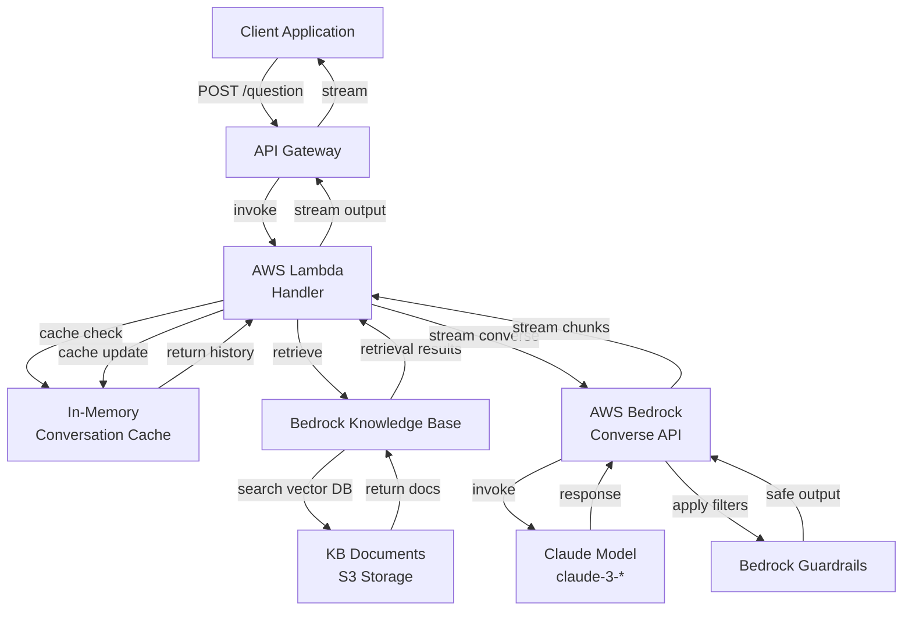

# Introduction

This project provides the base implementation for a serverless question-answering system using AWS Bedrock and a Knowledge Base (KB). It handles incoming questions, retrieves relevant context from the KB, and generates answers using the Converse API.

Key features include:

- Serverless architecture using AWS Lambda
- Integration with a Knowledge Base for context retrieval
- Streaming responses for real-time interaction
- Error handling and logging

Future enhancements may include support for backend-managed conversation memory and improved citation handling.

# Getting Started

## Prerequisites

- AWS Account with access to Bedrock and Lambda
- Knowledge Base setup
- Guardrails setup

## Deployment

1. Clone the repository.
2. Install dependencies using `npm install`.
3. Build the project using `npm run build`.
4. Deploy the Lambda function using AWS SAM or your preferred deployment method.

## Client Usage

An example client function to interact with the deployed Lambda function is provided below:

```JavaScript
async function askQuestion(question, sessionId = null) {
  const functionUrl = "https://function-url-goes-here"; // Replace with your function URL
  try {
    const response = await fetch(functionUrl, {
      method: "POST",
      body: JSON.stringify({ question, sessionId }),
    });

    if (!response.ok) {
      throw new Error(`HTTP error! status: ${response.status}`);
    }

    const reader = response.body.getReader();
    const decoder = new TextDecoder();
    let buffer = "";
    let currentSessionId = null;
    let isFirstChunk = true;

    while (true) {
      const { done, value } = await reader.read();
      if (done) break;

      buffer += decoder.decode(value, { stream: true });
      const lines = buffer.split("\n");

      // Keep the last incomplete line in the buffer
      buffer = lines.pop() || "";

      for (const line of lines) {
        if (!line.trim()) continue;

        try {
          const parsed = JSON.parse(line);

          // First chunk contains sessionId
          if (isFirstChunk && parsed.sessionId !== undefined) {
            currentSessionId = parsed.sessionId;
            isFirstChunk = false;
            continue;
          }

          // Subsequent chunks contain output
          if (parsed.output) {
            console.log(parsed.output);
          }

          // Handle citations if present
          if (parsed.citation && Object.keys(parsed.citation).length > 0) {
            console.log("Citations:", parsed.citation);
          }

          // Handle errors
          if (parsed.error) {
            console.error("Error:", parsed.error);
          }
        } catch (e) {
          console.warn("Failed to parse line:", line, e);
        }
      }
    }

    return currentSessionId;
  } catch (error) {
    console.error("Error:", error);
  }
}
```

# Architecture Diagram


